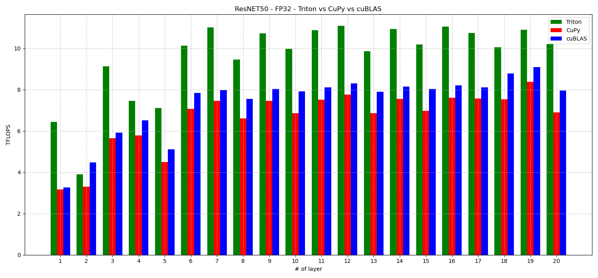

<table>
  <tr>
    <td align="left"></td>
    <td align="right"></td>
  </tr>
</table>
# Optimización de redes neuronales para GPUs con Triton

**Trabajo Fin de Máster - Máster Universitario en Ingeniería de Computadores y Redes - DISCA - UPV**  
**Autor**: Antonino Ciordia Barcos  
**Tutores**: Enrique S. Quintana-Ortí, Adrián Castelló 
<br><br>

<p align="center">
  
</p>

---

## Resumen

El objetivo principal de este Trabajo de Fin de Máster es el estudio, desarrollo y análisis de técnicas de optimización de redes neuronales profundas mediante el uso de [Triton](https://github.com/openai/triton), un compilador y modelo de programación de alto nivel desarrollado por OpenAI, diseñado para la generación de kernels eficientes en GPU. Debido al crecimiento del campo en los últimos años y la necesidad actual de poder de cómputo, esta memoria se centra en evaluar la viabilidad y eficacia del ecosistema Triton frente a entornos consolidados como CuPy o Torch.

El tipo de red sobre el que se centra este trabajo son las redes convolucionales modernas, sobre los que se aplicarán transoformaciones con el fin de reducirlos mayoritariamente a multiplicaciones de matrices (GEMM). Se implementarán versiones optimizadas de esta operación utilizando Triton, y se comparan cuantitativamente sus resultados frente a bibliotecas convencionales, tanto en términos de rendimiento como de portabilidad y expresividad del código.

Como modelos de referencia se emplean las arquitecturas VGG16 y ResNet-50, ampliamente utilizadas en visión por computador, sobre las cuales se realizan múltiples pruebas de rendimiento, variando parámetros como el tipo de dato, la arquitectura hardware sobre la que se ejecuta y los niveles de autotuning disponibles. Los resultados obtenidos revelan que Triton no solo permite alcanzar desempeños cercanos o incluso superiores a los logrados con implementaciones altamente optimizadas en CUDA, sino que además facilita una mayor portabilidad y simplificación en el desarrollo, al abstraer muchas de las complejidades iniciales que supone la programación en GPU.

---

## Resultados obtenidos

<p align="center">
  
</p>

---

## Estructura del repositorio

```text
TFM_Triton/
│
├── img/                          <- Imágenes empleadas en este documento
├── Ejecucion_modelos.ipynb       <- Notebook principal con ejecución de pruebas
├── requirements.txt              <- Librerías necesarias
├── resultados/                   <- Directorios con resultados y salidas
├── LICENSE                       <- Licencia del proyecto
└── README.md                     <- Este documento
```
---

## **Ejecución del proyecto**

Para ejecutar este trabajo, basta con tener Python instalado y seguir los pasos descritos a continuación. El entorno está diseñado para ser ligero y fácilmente reproducible.

Para ello debes descargar los siguientes dos archivos del repositorio:

- [`requirements.txt`](requirements.txt): contiene las librerías necesarias.
- [`Ejecucion_modelos.ipynb`](Ejecucion_modelos.ipynb): notebook principal con los experimentos.

Puedes descargarlos desde el repositorio o clonar todo con:

```bash
git clone https://github.com/anja2097/TFM_Triton.git
cd TFM_Triton
```
